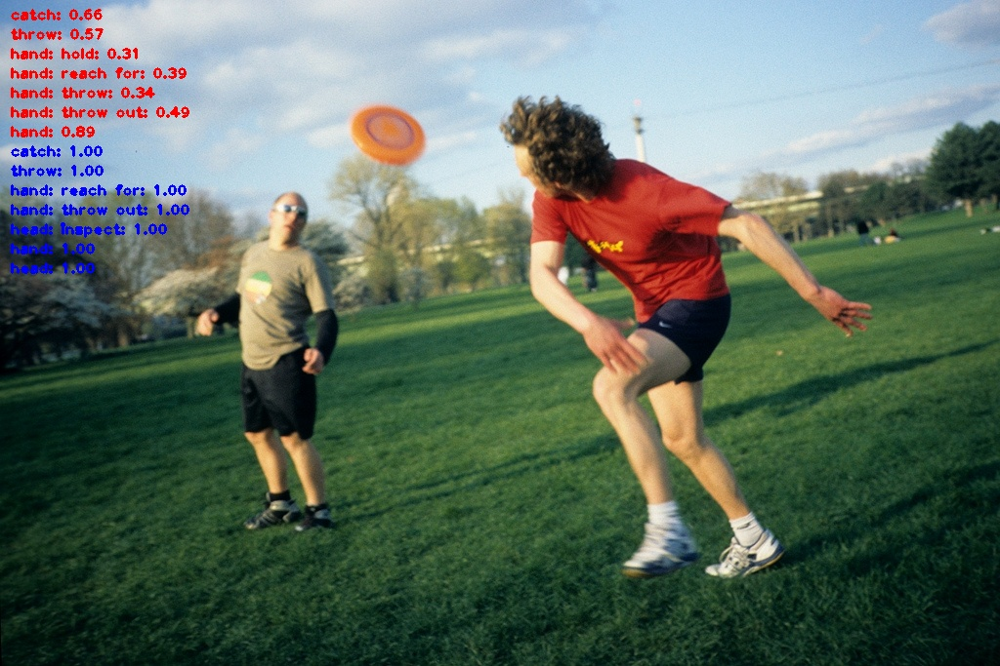

**CLIP-Activity2Vec**: Image-Level PaStaNet with CLIP-pretrain
========

<div class="center"></div>

# Prerequisite

## Installation
1. install PyTorch 1.5+ and torchvision 0.6+:

```
conda install -c pytorch pytorch torchvision
```

2. clone this repository
```
git clone https://github.com/DirtyHarryLYL/HAKE-Action-Torch.git PaStaNetCLIP
cd PaStaNetCLIP
git checkout CLIP-Activity2Vec

```


## Data Preparation
1. Download HAKE dataset from [here](https://1drv.ms/u/s!ArUVoRxpBphYgtVPpYBkJoJ1x6_HiQ?e=pWdrTY)

```
tar xzvf hake-large.tgz 
```

2. Organize your data as follows
```
PaStaNetCLIP
|_ data
    |_ hake
      |_ hake-large
      |  |_ hico-train
      |  |_ hico-test
      |  |_ ...
```
3. Download [annotations](https://pan.baidu.com/s/1pO_Ohf0uNP2_P_WUEt9hYQ?pwd=qnhd) and put them under **$PROJECT/data/hake** folder.


4. Download the CLIP pretrained model from [Baidu Pan](https://pan.baidu.com/s/1sfrzvEreatblK_2zcD3oVg?pwd=84ks) or [Google Drive](https://drive.google.com/drive/folders/1UinM-mz38Pn2ym3LGGL0y7aLBhRXXRWN?usp=sharing) (ViT-B-16.new.pt: original CLIP pre-trianed model, ckpt_4.pth: finetuned model on HAKE data) and put it in **$PROJECT/pretrained/clip**.


# Pretrained Model

Backbone: ViT-B/16

data split: train/val

model weights: [link](https://pan.baidu.com/s/11UPH3EH5_ZbE7X3G6WvwTw?pwd=t3wl)


| -      | mAP |
| ----------- | ----------- | 
| foot    |   64.6     |
| leg    |    76.3    |
| hip    |    64.5    |
| hand    |   44.7     |
| arm    |    72.9    |
| head    |    60.6    |
| binary    |    81.0    |
| verb    |  68.1      |


# Usage 

## Training

```bash
  # by default, we use gpu x batch : 8x4
  # you can use --batch_size and --nproc_per_node to adjust the batch size and number of GPUS. 
  ./run.sh
```

## Testing
```bash
 # set --vis_test to visualize the predicition
 ./test.sh
```


# Citation
If you find our works useful, please consider citing:
```
@inproceedings{li2020pastanet,
  title={PaStaNet: Toward Human Activity Knowledge Engine},
  author={Li, Yong-Lu and Xu, Liang and Liu, Xinpeng and Huang, Xijie and Xu, Yue and Wang, Shiyi and Fang, Hao-Shu and Ma, Ze and Chen, Mingyang and Lu, Cewu},
  booktitle={CVPR},
  year={2020}
}

```
