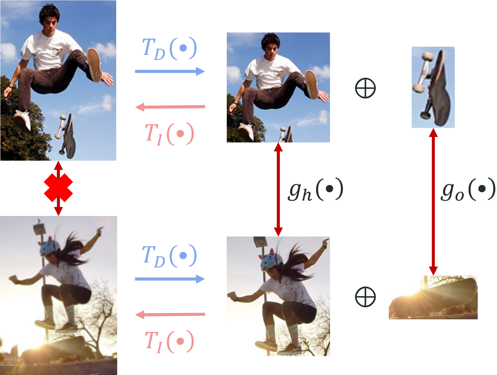

# IDN: Integrating-Decomposing Network

#### Code of "HOI Analysis: Integrating and Decomposing Human-Object Interaction" (NeurIPS 2020)
#### Yong-Lu Li*, Xinpeng Liu*, Xiaoqian Wu, Yizhuo Li, Cewu Lu (*=equal contribution).
#### [arXiv]()

As a part of [HAKE-Action-Torch](https://github.com/DirtyHarryLYL/HAKE-Action-Torch) project, you could also use the sub-module in unified [HAKE-Action-Torch](https://github.com/DirtyHarryLYL/HAKE-Action-Torch) framework.

<p align='center'>
    
</p>

## Requirements

### Setting up environment

```
pip install -r requirements.txt
```

### Download data

```
bash script/Download_.py
```

## Getting started

### 1. AE pre-train

```shell
export CUDA_VISIBLE_DEVICES=0;python train.py --exp AE --config_path configs/AE.yml
```

### 2. IDN training without IPT (Inter-pair transformation)

```shell
export CUDA_VISIBLE_DEVICES=0;python train.py --exp IDN --config_path configs/IDN.yml
```

### 3. IDN finetuning with IPT

```shell
export CUDA_VISIBLE_DEVICES=0;python train.py --exp IPT --config_path configs/IPT.yml
```

### 4. Evaluation

To get our reported result on HICO-DET with COCO evaluator, run 

```
python eval.py --config_path configs/eval_hico_coco.yml --exp eval_hico_coco
python get_map.py --exp eval_hico_coco
```

Other detection settings and V-COCO are coming soon!

## Pre-trained models

For HICO-DET: 

For V-COCO: Coming soon!

## Results

## Results

Our model achieves the following performance on :

### [HICO-DET](https://paperswithcode.com/sota/human-object-interaction-detection-on-hico)

|Method|Full(def) | Rare(def) | None-Rare(def)| Full(ko) | Rare(ko) | None-Rare(ko) |
| ------------------    |---------------- | -------------- |-|-|-|-|
| IDN (COCO Detector)   | 23.36 | 22.47 | 23.63 | 26.43 | 25.01 | 26.85 |
| IDN (HICO-DET Detector from VCL)   |24.58 | 20.33|25.86|27.89 | 23.64| 29.16|
| IDN (HICO-DET Detector from DRG)   |26.29 | 22.61|27.39|28.24 | 24.47| 29.37|
| IDN (GT Detection)    |43.98 | 40.27 | 45.09 | - | - | - |


### [V-COCO](https://paperswithcode.com/sota/human-object-interaction-detection-on-v-coco)


|Method|AP role, Scenario 1| AP role, Scenario 2 | 
| ------------------    |---------------- | -------------- |
| IDN    |53.3|60.3|

## Contributing

## Acknowledgement

Some of our code are built upon HAKE-Action, analogy and VSGNet.
